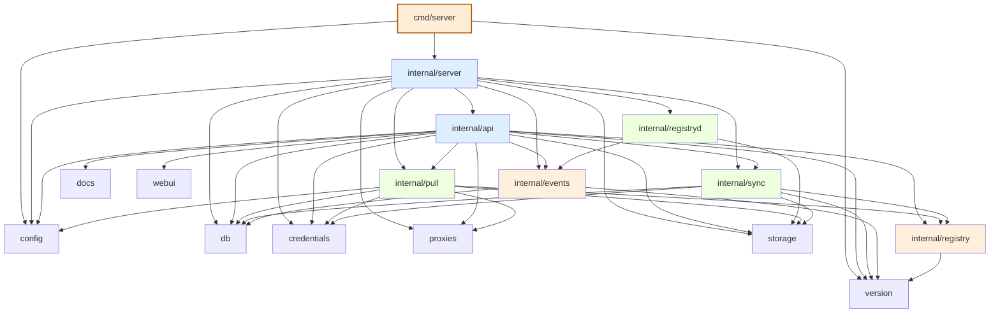

# Cairn 代码模块结构

> Last reviewed: **v0.7.36** · HEAD `2458e8d` · 配套 review: [`docs/review/v0.7.36-cross-module.md`](./review/v0.7.36-cross-module.md)

cairn 单进程单二进制（标准库 + chi + golang.org/x/sync + modernc.org/sqlite），15 个 internal 包 + 2 个 cmd。本文描述各模块的角色、分层、依赖方向、入口组装和关键调用链。

## 1. 分层架构

按"被依赖深度"分 5 层：

```
L0  Foundation  (8 包 · 全部 0 outbound deps)
    ├─ version        仅常量: Version / UserAgent             inb:4
    ├─ storage        Storage 接口 + Filesystem 实现           inb:5
    ├─ credentials    AES-256-GCM vault                        inb:4
    ├─ proxies        明文 JSON store                          inb:3
    ├─ db             SQLite (modernc.org/sqlite, 纯 Go)       inb:5
    ├─ config         env boot 解析 + Mutable UI 配置          inb:3
    ├─ docs           embed Swagger UI 5.33.1 + openapi.yaml   inb:1
    └─ webui          embed React SPA (build tag `webui`)      inb:1

L1  Thin adapters (on top of L0)
    ├─ registry       Registry interface + Client 实现         inb:4
    └─ events         Distribution webhook + heat 聚合         inb:3

L2  Engines / servers
    ├─ registryd      /v2/* 服务（data plane）                  inb:1
    ├─ pull           FIFO 拉取队列 + 编排                     inb:2
    └─ sync           cairn↔cairn 镜像                          inb:2

L3  HTTP 控制面
    └─ api            chi handlers (/api/*)                    inb:1

L4  组装层
    └─ server         Build(cfg) → Runtime                     inb:0

Cmd 入口
    ├─ cmd/server         main → server.Build + Start/Stop
    └─ cmd/verify-export  tar shape 验证工具（CI 替代 docker load）
```

## 2. 完整依赖图



无循环依赖（已用 `go list` 验证）。`api` 是 inbound 唯一来源（仅 `server` 引用它），`server` 不被任何 internal 包引用（只被 cmd 引用），形成干净的"漏斗"。

## 3. 模块清单

| 包 | 层 | 1 行职责 | 关键导出 | 备注 |
|---|---|---|---|---|
| `internal/version` | L0 | release version 单源 | `Version`, `UserAgent`, `SyncUserAgent`, `ProbeUserAgent` | 任何改动要同步 5 处（见 AGENTS.md §"版本号规则"） |
| `internal/storage` | L0 | V2 兼容的 blob/manifest 存储抽象 | `Storage` 接口 + `Filesystem` 实现 | data plane + control plane 同一实例；删除即同一操作 |
| `internal/credentials` | L0 | AES-256-GCM 凭据 vault | `Vault` (Put/Get/List/Delete) | 整文件加密；per-record 会泄露 schema |
| `internal/proxies` | L0 | 上游代理明文 JSON store | `Store` | 代理 URL 非机密，明文足够 |
| `internal/db` | L0 | SQLite 热度 + pull history + sync 状态 | `Db` + 12 个 row type | `modernc.org/sqlite` 纯 Go，无 CGO；约 30% 慢于 mattn 写，但 append-only 够用 |
| `internal/config` | L0 | env boot 解析 + UI Mutable 配置合并 | `Config`, `Mutable`, `Load()` | v0.5.9 后业务配置全部走 UI，env 只剩 4 个 |
| `internal/docs` | L0 | embed Swagger UI + hand-rolled openapi.yaml | `Mount(r chi.Router)` | `internal/docs/dist/` vendored，无 npm 构建依赖 |
| `internal/webui` | L0 | embed React SPA | `Handler()`, `Enabled()` | 需 `go build -tags webui`，否则 stub 404 |
| `internal/registry` | L1 | Registry interface + Client 实现 | `Registry`, `Client`, `BearerAuth`, `CachedRegistry` | handlers 通过接口依赖，测试可换 fake |
| `internal/events` | L1 | Distribution webhook + heat 聚合 | `Handler`, `ShouldCount`, `VerifySignature` | in-memory 计数，restart reset |
| `internal/registryd` | L2 | /v2/* 服务（data plane） | `New`, `NewWithOnWrite`, `Handler` | 让 cairn 是 registry，不只是 registry UI |
| `internal/pull` | L2 | FIFO 拉取队列 | `Executor`, `Orchestrator`, `Job`, `JobState`, `SourceResolver` | 单 concurrent，cancel 协作式 |
| `internal/sync` | L2 | cairn↔cairn 镜像 | `Engine`, `Scheduler`, `Store`, `ProbeConnection` | pull/push per task，async runs |
| `internal/api` | L3 | chi handlers (/api/*) | `NewRouter`, `Handlers`, `ExtraHandlers` | 错误响应统一 `{error:{code,message,detail}}` |
| `internal/server` | L4 | 装配 Runtime | `Build`, `Runtime`, `Start`, `Stop` | cmd 只调这 3 方法 |
| `cmd/server` | 入口 | main → Build + Start/Stop | `-healthz` flag | 仅 import `config`, `server`, `version` |
| `cmd/verify-export` | 工具 | tar shape 验证（CI 替代 docker load） | (CLI) | 仅导入 storage，独立运行 |

## 4. Inbound 高频包

按 inbound 排序（被多少个其他包依赖）：

| 包 | Inbound | 谁 import 它 |
|---|---|---|
| `storage` | 5 | api, pull, registryd, server, sync |
| `db` | 5 | api, events, pull, server, sync |
| `version` | 4 | api, events, registry, sync |
| `credentials` | 4 | api, pull, server, sync |
| `registry` | 4 | api, pull, server, sync |
| `config` | 3 | api, pull, server |
| `proxies` | 3 | api, pull, server |
| `events` | 3 | api, registryd, server |
| `pull` | 2 | api, server |
| `sync` | 2 | api, server |

**观察**：
- `storage` 和 `db` 是双 foundation：横跨 L0/L1/L2/L3 都被依赖
- `version` 跨 L0/L1/L2（events, registry, sync 均依赖），仅常量包却穿透 3 层 — 这是 User Agent 派生需求，不是分层漏洞
- `api` inbound=1 正常（HTTP 层在顶端）；`server` inbound=0（cmd 直接调）
- 没有 inbound > 5 的"超级 god package"，分层纪律成立

## 5. 入口与组装

### 5.1 `cmd/server/main.go`（80 行，干净）

```
main()
  ├─ flag.Parse()                              // 可选 -healthz 探活模式
  ├─ config.Load()                             // env → Config struct
  ├─ server.Build(cfg)                         // 见 §5.2 的 9 步
  ├─ signal.NotifyContext(SIGTERM, SIGINT)
  ├─ rt.Start(ctx)                             // 启 background goroutines + http.Server
  └─ rt.Stop()                                 // 30s grace drain
```

main.go 仅 import 3 个包：`config`, `server`, `version` —— 体现"main 极薄、靠 Build 装配"的纪律。

### 5.2 `server.Build` 的 9 步组装顺序

来自 `server.Build` 的 doc comment（data plane 先，control plane 后）：

1. **Storage** — filesystem backend for blobs + manifests + tags
2. **V2 router** at `/v2/*`（`registryd`）— 真正的 registry API
3. **SQLite** (`db`) — stats + history
4. **Credential vault + Proxy store**
5. **External registry client** (`registry.Client`) — 用于从 Docker Hub 拉
6. **Pull executor + orchestrator**
7. **Events handler** — webhook receiver
8. **Admin API + extras** (`api/`) — browse/delete/...
9. **Composite router** — chi subroutes for `/api`, `/v2`, `/healthz`, `/api/docs`

## 6. 关键调用链

### 6.1 启动链

```
cmd/server → config.Load() → server.Build(cfg) → rt.Start(ctx)
  → goroutines: db retention / sync scheduler / events handler
  → http.Server.ListenAndServe() → rt.Stop()  // 30s grace
```

### 6.2 HTTP 控制面（GET /api/...）

```
chi router → api.Handlers.<X>  (depends on route)
  → h.DB / h.Vault / h.Store / h.Registry / ...
  → JSON response  // 错误也走 JSON: {error:{code,message,detail}}
```

### 6.3 HTTP 数据面（GET /v2/<name>/manifests/<ref>）

```
/v2/.../manifests/<ref>
  → registryd.Handler
  → storage.Storage.GetManifest(name, ref)
  → 响应 raw manifest bytes（Accept 头处理 4 种 manifest media type）
```

### 6.4 Pull 任务（POST /api/pull）

```
api.Handlers.PullCreate
  → pull.Executor.Enqueue(NewJob)
  → pull.Orchestrator.run (后台)
      → SourceResolver → registry.Client (上游)
      → stream chunks → storage.Storage (本地)
      → db.Db.InsertPullJob (历史)
```

### 6.5 Sync 任务（POST /api/sync/:id/run）

```
api.Handlers.SyncRun
  → sync.Engine.Start(taskID)
  → async goroutine:
      → registry.Client.GetCatalog (源 cairn)
      → for each repo: registry.Client.GetManifestList
      → storage.Storage.PutManifest (目标 cairn)
      → db.InsertSyncRunItem (进度)
```

### 6.6 凭据读取（任何认证请求）

```
caller (pull / sync / api)
  → credentials.Vault.GetByRegistryURL(targetURL)
  → BasicAuth 或 BearerAuth 注入 http.Client
```

## 7. 嵌入式资源

| 资源 | 触发条件 | 影响 |
|---|---|---|
| `internal/webui/dist/` (Vite 输出) | `go build -tags webui` | 否则 stub 返回 404 + hint |
| `internal/docs/dist/` (Swagger UI 5.33.1) | always | vendored，无 npm 构建依赖 |
| `web/dist/` 未生成 | 自动 stub | 0 体积 |

`internal/webui.Enabled()` 检查 build tag 注入；`internal/docs.Mount(r)` 注册 `/api/docs`、`/api/docs/openapi.yaml`、`/api/docs/*`。

## 8. 明确不做的事（per AGENTS.md）

cairn 刻意不实现：

- ❌ 登录 / 用户体系 / RBAC
- ❌ 镜像扫描 / CVE 检测
- ❌ 镜像签名 / cosign 集成
- ❌ 多 registry 聚合
- ❌ 配额 / 速率限制
- ❌ Helm chart / OCI artifact 浏览
- ❌ HTTPS / TLS（**v0.6.0 触发**，详见 AGENTS.md §"HTTPS / TLS 证书管理"）

## 9. 配套材料

- review 报告（待 explore 证据挖掘完成后产出）：`docs/review/v0.7.36-cross-module.md`
- 设计文档：`docs/design/`
- 已知问题：`docs/issues/`
- ROADMAP：`docs/ROADMAP.md`
- resilience & sync known issues：`docs/resilience.md`、`docs/sync-known-issues.md`